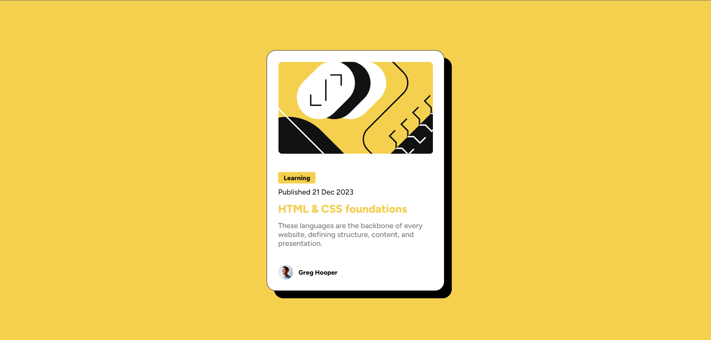

# Frontend Mentor - Blog preview card solution

This is a solution to the [Blog preview card challenge on Frontend Mentor](https://www.frontendmentor.io/challenges/blog-preview-card-ckPaj01IcS). Frontend Mentor challenges help you improve your coding skills by building realistic projects. 

## Table of contents

- [Overview](#overview)
  - [The challenge](#the-challenge)
  - [Screenshot](#screenshot)
  - [Links](#links)
- [My process](#my-process)
  - [Built with](#built-with)
  - [What I learned](#what-i-learned)
  - [Continued development](#continued-development)
  - [Useful resources](#useful-resources)
- [Author](#author)


## Overview

### The challenge

Users should be able to:

- See hover and focus states for all interactive elements on the page

### Screenshot




### Links

- Live Site URL: [Preview site](https://hinn1411.github.io/blog_preview_card/)

## My process
- Center the main tag vertically and horizontally
- Creating HTML structure for the challenge
- Styling with CSS
- Researching new knowledge
- Fixing some bugs and unexpected behaviors

### Built with

- HTML
- CSS (Flexbox, Cursor, Pseudo-classes)

### What I learned

I learned an interesting CSS snippet. It is used to select all directive elements of a parent, except the first one.
```css
.main-author_container > *:not(:first-child) {
  margin-left: 12px;
}
```


### Continued development

Continuing to learn CSS pseudo classes & elements for better element selection.


### Useful resources

- [Creating a custom mouse cursor with CSS](https://blog.logrocket.com/creating-custom-mouse-cursor-css/#how-create-custom-cursor-css) - This is an amazing article for creating custom cursor.


## Author

- Guagn Tuan Hien - [@hinn1411](https://www.frontendmentor.io/profile/hinn1411)

